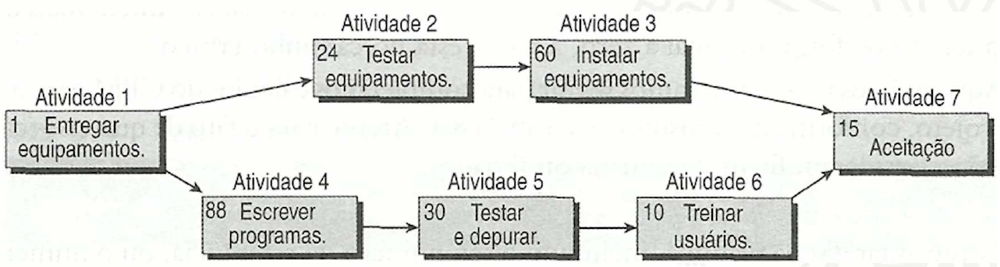
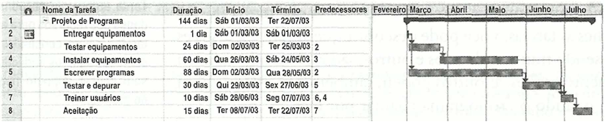
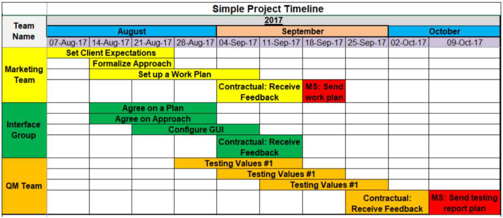

# Especificações do Projeto

Pré-requisitos: <a href="1-Documentação de Contexto.md"> Documentação de Contexto</a>

Definição do problema e ideia de solução a partir da perspectiva do usuário. É composta pela definição do  diagrama de personas, histórias de usuários, requisitos funcionais e não funcionais além das restrições do projeto.

Apresente uma visão geral do que será abordado nesta parte do documento, enumerando as técnicas e/ou ferramentas utilizadas para realizar a especificações do projeto

## Personas

Pedro Paulo tem 26 anos, é arquiteto recém-formado e autônomo. Pensa em se desenvolver profissionalmente através de um mestrado fora do país, pois adora viajar, é solteiro e sempre quis fazer um intercâmbio. Está buscando uma agência que o ajude a encontrar universidades na Europa que aceitem alunos estrangeiros.

Enumere e detalhe as personas da sua solução. Para tanto, baseie-se tanto nos documentos disponibilizados na disciplina e/ou nos seguintes links:

## 01 - Davi Lutier

**Idade:** 38 anos  
**Profissão:** Dono de Mercearia  
**Localização:** São Paulo, Brasil  
**Formação:** Ensino Médio  
**Objetivo:** Organizar e administrar de forma mais facil as pessoas que estão em débito

## Descrição  
Davi Lutier é dono de um pequeno comércio e lida diariamente com clientes fiéis. Para manter o bom relacionamento, ele costuma vender fiado ou parcelar pagamentos informalmente. Com o tempo, passou a ter dificuldades para controlar quem está devendo, quanto deve e há quanto tempo a dívida existe. Hoje, Davi usa anotações em cadernos e mensagens no WhatsApp, o que gera confusão, esquecimentos e prejuízos financeiros.

## Dores  
- Não consegue lembrar exatamente quem está devendo e quanto cada pessoa deve.

- Perde tempo procurando anotações antigas ou mensagens espalhadas.

- Sente desconforto ao cobrar clientes por não ter informações claras.

- Já teve prejuízos financeiros por esquecer ou perder registros de dívidas.

## Expectativas  
- Ter uma lista organizada de pessoas devedoras, com valores e datas.

- Conseguir registrar novas dívidas rapidamente, direto pelo celular.

- Visualizar alertas ou lembretes de cobranças pendentes.

- Manter um histórico simples e confiável, sem precisar de planilhas ou papel.

 ## 02 - Victor Ferraz

- **Idade**: 45 anos
- **Profissão**: Autônomo / Investidor informal
- **Localização**: Belo Horizonte, Brasil
- **Formação**: Ensino Médio completo
- **Objetivo**: Reduzir erros de cálculo e retrabalho, usando uma ferramenta confiável e automatizada.

## Descrição

Victor Ferraz empresta dinheiro para conhecidos como uma forma de renda extra. Ele sempre combina juros antes do empréstimo, mas faz esse controle de maneira informal, usando blocos de notas e planilhas simples. Com o aumento da quantidade de pessoas que tomam dinheiro emprestado, Marcos começou a se perder nos cálculos de juros, prazos e no lucro real obtido em cada empréstimo.

## Dores

- Dificuldade em calcular corretamente juros acumulados.

- Falta de visão clara sobre o lucro real de cada empréstimo.

- Risco de erro ao usar planilhas manuais.

- Perda de tempo recalculando valores sempre que alguém paga parcialmente.

## Expectativas

- Definir valor emprestado, juros e prazo no momento do registro.

- Cálculo automático do valor total a receber.

- Visualização clara do lucro obtido com juros.

- Histórico detalhado de pagamentos e empréstimos concluídos.

  ## 03 - Carla Menezes

 

- **Idade**: 32 anos
- **Profissão**: Microempreendedora
- **Localização**: Curitiba, Brasil
- **Formação**: Graduação em Marketing Digital
- **Objetivo**: Visualizar facilmente quanto já recebeu e quanto ainda falta receber.

## Descrição

Carla empresta dinheiro para amigos, familiares e conhecidos do bairro, sempre cobrando juros acordados verbalmente. Ela não se considera uma investidora, mas vê isso como uma forma de ajudar e, ao mesmo tempo, ganhar um retorno financeiro. O problema é que Carla se confunde com valores, datas e quanto realmente lucrou no final de cada empréstimo.

## Dores

- Esquece datas de pagamento combinadas.

- Não sabe exatamente quanto lucrou em cada empréstimo.

- Dificuldade para acompanhar pagamentos parciais.

- Falta de organização gera conflitos com quem pegou dinheiro emprestado.

## Expectativas

- Cadastro rápido de empréstimos pelo celular.

- Definição clara de juros personalizados por pessoa.

- Visualização simples do lucro total e por empréstimo.

- Alertas de vencimento e controle de pagamentos parciais.
 
> **Links Úteis**:
> - [Rock Content](https://rockcontent.com/blog/personas/)
> - [Hotmart](https://blog.hotmart.com/pt-br/como-criar-persona-negocio/)
> - [O que é persona?](https://resultadosdigitais.com.br/blog/persona-o-que-e/)
> - [Persona x Público-alvo](https://flammo.com.br/blog/persona-e-publico-alvo-qual-a-diferenca/)
> - [Mapa de Empatia](https://resultadosdigitais.com.br/blog/mapa-da-empatia/)
> - [Mapa de Stalkeholders](https://www.racecomunicacao.com.br/blog/como-fazer-o-mapeamento-de-stakeholders/)
>
Lembre-se que você deve ser enumerar e descrever precisamente e personalizada todos os clientes ideais que sua solução almeja.

## Histórias de Usuários

Com base na análise das personas forma identificadas as seguintes histórias de usuários:

|EU COMO... `PERSONA`| QUERO/PRECISO ... `FUNCIONALIDADE` |PARA ... `MOTIVO/VALOR`                 |
|--------------------|------------------------------------|----------------------------------------|
|Davi  | cadastrar o nome, contato e descrição de um devedor                    | identificar facilmente quem está me devendo      |
|Davi  | registrar uma nova dívida com valor e data da transação                | manter controle das vendas feitas fiado          |
|Davi  |	definir uma data de vencimento para cada dívida                        |	saber quando devo cobrar o cliente               |
|Davi  |	marcar uma dívida como pendente, parcialmente paga ou liquidada        |	acompanhar o status dos pagamentos               |
|Marcos|	registrar um empréstimo informando valor principal e taxa de juros     |	calcular corretamente o retorno do empréstimo    |
|Marcos|	visualizar automaticamente o valor total a receber (principal + lucro) |	entender quanto irei ganhar com o empréstimo     |
|Marcos|	visualizar um resumo do dinheiro emprestado e do lucro previsto        |	acompanhar meus ganhos e investimentos           |
|Marcos|	registrar quando um pagamento parcial ou total é realizado             |	manter controle sobre quanto ainda falta receber |
|Carla |	cadastrar rapidamente pessoas que pegaram dinheiro emprestado	         | organizar melhor meus registros                  |
|Carla |	definir juros ou acréscimos em cada empréstimo                         |	garantir que eu tenha lucro nas transações       |
|Carla |	receber notificações na data de vencimento das dívidas                 |	não esquecer de cobrar quem me deve              |
|Carla |	visualizar o valor total de dinheiro emprestado e lucro esperado       |	entender quanto estou ganhando com essa atividade|

Apresente aqui as histórias de usuário que são relevantes para o projeto de sua solução. As Histórias de Usuário consistem em uma ferramenta poderosa para a compreensão e elicitação dos requisitos funcionais e não funcionais da sua aplicação. Se possível, agrupe as histórias de usuário por contexto, para facilitar consultas recorrentes à essa parte do documento.

> **Links Úteis**:
> - [Histórias de usuários com exemplos e template](https://www.atlassian.com/br/agile/project-management/user-stories)
> - [Como escrever boas histórias de usuário (User Stories)](https://medium.com/vertice/como-escrever-boas-users-stories-hist%C3%B3rias-de-usu%C3%A1rios-b29c75043fac)
> - [User Stories: requisitos que humanos entendem](https://www.luiztools.com.br/post/user-stories-descricao-de-requisitos-que-humanos-entendem/)
> - [Histórias de Usuários: mais exemplos](https://www.reqview.com/doc/user-stories-example.html)
> - [9 Common User Story Mistakes](https://airfocus.com/blog/user-story-mistakes/)

## Requisitos

As tabelas que se seguem apresentam os requisitos funcionais e não funcionais que detalham o escopo do projeto. Para determinar a prioridade de requisitos, aplicar uma técnica de priorização de requisitos e detalhar como a técnica foi aplicada.

<strong>Crie no mínimo 12 Requisitos funcionais, 6 não funcionais e 3 restrições</strong>
<strong>Cada aluno será responsável pela execução completa (back, web e mobile) de pelo menos 2 requisitos que será acompanhado pelo professor</strong>
### Requisitos Funcionais

|ID    | Descrição do Requisito  | Prioridade | Responsável |
|------|-----------------------------------------|----|----|
|RF-001| O sistema deve permitir registrar o nome, contato e uma breve descrição de cada devedor.  | ALTA | Pedro |
|RF-002| O usuário deve conseguir inserir o valor principal, a taxa de juros ou acréscimo (lucro) e a data da transação.   | MÉDIA | João |
|RF-003| A aplicação deve calcular e exibir automaticamente o valor total a ser recebido (Principal + Lucro)   | MÉDIA | João |
|RF-004| O usuário deve definir uma data de vencimento para cada dívida cadastrada.   | MÉDIA | João |
|RF-005| O sistema deve enviar alertas ou notificações no dia exato estipulado para cobrar o devedor.   | MÉDIA | João |
|RF-006| Deve ser possível marcar as dívidas como "Pendente", "Pago Parcialmente" ou "Liquidado"   | MÉDIA | João |
|RF-007| A aplicação deve gerar um resumo do total de dinheiro "na rua" e o lucro total previsto para o mês.   | MÉDIA | João |

### Requisitos não Funcionais

|ID     | Descrição do Requisito  |Prioridade |
|-------|-------------------------|----|
|RNF-001| Por ser focado em pequenos comerciantes, o design deve ser intuitivo e fácil de usar em dispositivos móveis. | MÉDIA | 
|RNF-002| Os dados financeiros devem ser protegidos por senha, biometria ou autenticação de dois fatores (2FA). |  ALTA |
|RNF-003| O comerciante deve conseguir consultar e registrar dívidas mesmo sem conexão com a internet, sincronizando os dados posteriormente. |  MÉDIA |
|RNF-004| O carregamento da lista de devedores e cálculos de juros deve ocorrer em menos de 2 segundos. |  MÉDIA |
|RNF-005| O sistema deve garantir que os dados dos devedores não sejam compartilhados com terceiros, seguindo as diretrizes da LGPD (Lei Geral de Proteção de Dados). |  ALTA |
|RNF-006| A aplicação deve ser responsiva, funcionando perfeitamente em sistemas Android e iOS. |  BAIXA |
|RNF-007| O sistema deve realizar cópias de segurança em nuvem (ex: Google Drive) para evitar perda de dados em caso de troca de aparelho. |  MÉDIA |

Com base nas Histórias de Usuário, enumere os requisitos da sua solução. Classifique esses requisitos em dois grupos:

- [Requisitos Funcionais
 (RF)](https://pt.wikipedia.org/wiki/Requisito_funcional):
 correspondem a uma funcionalidade que deve estar presente na
  plataforma (ex: cadastro de usuário).
- [Requisitos Não Funcionais
  (RNF)](https://pt.wikipedia.org/wiki/Requisito_n%C3%A3o_funcional):
  correspondem a uma característica técnica, seja de usabilidade,
  desempenho, confiabilidade, segurança ou outro (ex: suporte a
  dispositivos iOS e Android).
Lembre-se que cada requisito deve corresponder à uma e somente uma
característica alvo da sua solução. Além disso, certifique-se de que
todos os aspectos capturados nas Histórias de Usuário foram cobertos.

## Restrições

O projeto está restrito pelos itens apresentados na tabela a seguir.

|ID| Restrição                                             |                                                                                       |
|--|-------------------------------------------------------|---------------------------------------------------------------------------------------|
|01| Tecnologia Multiplataforma       | O código deve ser único para rodar em Web, Android e iOS (não pode fazer um código separado para cada um). |
|02| Custo Zero de Licenciamento       | Não podem ser usadas ferramentas pagas no desenvolvimento; apenas tecnologias gratuitas ou de código aberto. |
|03| Dependência de Conexão        | O sistema não pode depender de internet de alta velocidade para funcionar (deve ser leve para redes 3G). |
|04| Segurança da Informação        | É proibido armazenar senhas em texto simples; deve-se usar criptografia para proteger os dados dos comerciantes. |
|05| Identidade Visual        | O design deve seguir estritamente o guia de cores e logo do "Paga Aí", sem usar componentes padrão de outros sistemas. |
|06| Escalabilidade de Dados        | O banco de dados não pode ser apenas local; deve suportar o crescimento para milhares de usuários simultâneos. |
|07| Limitação Financeira        | O app não pode realizar cobranças bancárias (boletos/PIX) diretamente, funcionando apenas como uma agenda de controle. |

Enumere as restrições à sua solução. Lembre-se de que as restrições geralmente limitam a solução candidata.

> **Links Úteis**:
> - [O que são Requisitos Funcionais e Requisitos Não Funcionais?](https://codificar.com.br/requisitos-funcionais-nao-funcionais/)
> - [O que são requisitos funcionais e requisitos não funcionais?](https://analisederequisitos.com.br/requisitos-funcionais-e-requisitos-nao-funcionais-o-que-sao/)

## Diagrama de Casos de Uso

O diagrama de casos de uso é o próximo passo após a elicitação de requisitos, que utiliza um modelo gráfico e uma tabela com as descrições sucintas dos casos de uso e dos atores. Ele contempla a fronteira do sistema e o detalhamento dos requisitos funcionais com a indicação dos atores, casos de uso e seus relacionamentos. 

As referências abaixo irão auxiliá-lo na geração do artefato “Diagrama de Casos de Uso”.

> **Links Úteis**:
> - [Criando Casos de Uso](https://www.ibm.com/docs/pt-br/elm/6.0?topic=requirements-creating-use-cases)
> - [Como Criar Diagrama de Caso de Uso: Tutorial Passo a Passo](https://gitmind.com/pt/fazer-diagrama-de-caso-uso.html/)
> - [Lucidchart](https://www.lucidchart.com/)
> - [Astah](https://astah.net/)
> - [Diagrams](https://app.diagrams.net/)

# Gerenciamento de Projeto

De acordo com o PMBoK v6 as dez áreas que constituem os pilares para gerenciar projetos, e que caracterizam a multidisciplinaridade envolvida, são: Integração, Escopo, Cronograma (Tempo), Custos, Qualidade, Recursos, Comunicações, Riscos, Aquisições, Partes Interessadas. Para desenvolver projetos um profissional deve se preocupar em gerenciar todas essas dez áreas. Elas se complementam e se relacionam, de tal forma que não se deve apenas examinar uma área de forma estanque. É preciso considerar, por exemplo, que as áreas de Escopo, Cronograma e Custos estão muito relacionadas. Assim, se eu amplio o escopo de um projeto eu posso afetar seu cronograma e seus custos.

## Gerenciamento de Tempo

Com diagramas bem organizados que permitem gerenciar o tempo nos projetos, o gerente de projetos agenda e coordena tarefas dentro de um projeto para estimar o tempo necessário de conclusão.

O gráfico de Gantt ou diagrama de Gantt também é uma ferramenta visual utilizada para controlar e gerenciar o cronograma de atividades de um projeto. Com ele, é possível listar tudo que precisa ser feito para colocar o projeto em prática, dividir em atividades e estimar o tempo necessário para executá-las.

## Gerenciamento de Equipe

O gerenciamento adequado de tarefas contribuirá para que o projeto alcance altos níveis de produtividade. Por isso, é fundamental que ocorra a gestão de tarefas e de pessoas, de modo que os times envolvidos no projeto possam ser facilmente gerenciados. 

