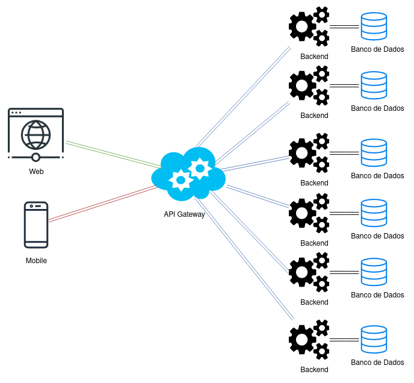

# Arquitetura da Solução

<span style="color:red">Pré-requisitos: <a href="3-Projeto de Interface.md"> Projeto de Interface</a></span>

Definição de como o software é estruturado em termos dos componentes que fazem parte da solução e do ambiente de hospedagem da aplicação.


## Diagrama de Classes

O diagrama de classes ilustra graficamente como será a estrutura do software, e como cada uma das classes da sua estrutura estarão interligadas. Essas classes servem de modelo para materializar os objetos que executarão na memória.




## Documentação do Banco de Dados MongoDB

Este documento descreve a estrutura e o esquema do banco de dados não relacional utilizado por nosso projeto, baseado em MongoDB. O MongoDB é um banco de dados NoSQL que armazena dados em documentos JSON (ou BSON, internamente), permitindo uma estrutura flexível e escalável para armazenar e consultar dados.

## Esquema do Banco de Dados

### Coleção: notificacoes

A aplicação utiliza o MongoDB como banco de dados NoSQL, armazenando os dados em formato de documentos dentro da coleção "notificacoes".

###  Estrutura de Documento
```Json
{
  "id": 1,
  "clienteId": 10,
  "clienteNome": "João",
  "cobrador": "Maria",
  "mensagem": "Pagamento pendente",
  "lida": false,
  "data": "2026-04-12",
  "dataCriacao": "2026-04-12",
  "tipo": "Cobranca",
  "valor": 150.00,
  "dataVencimento": "2026-04-15"
}
```

###  Descrição dos Campos Notificação

> - <strong>Id (int):</strong> identificador único da notificação
> - <strong>ClienteId (int):</strong> identificador do cliente
> - <strong>ClienteNome (string):</strong> nome do cliente
> - <strong>Cobrador (string):</strong> nome do cobrador responsável
> - <strong>Mensagem (string, opcional):</strong> conteúdo da notificação
> - <strong>Lida (bool):</strong> indica se a notificação foi visualizada
> - <strong>Data (DateTime):</strong> data da notificação
> - <strong>DataCriacao (DateTime):</strong> data de criação do registro
> - <strong>EmprestimoId (int, opcional):</strong> referência ao empréstimo
> - <strong>Tipo (string):</strong> tipo da notificação (ex: cobrança)
> - <strong>Valor (decimal):</strong> valor da cobrança
> - <strong>DataVencimento (DateTime):</strong> data de vencimento

---

### Coleção: clientes

A aplicação utiliza o MongoDB como banco de dados NoSQL, armazenando os dados em formato de documentos dentro da coleção "clientes".

###  Estrutura de Documento
```Json
{
  "id": 1,
  "nome": "João Silva",
  "cpf": "123.456.789-00",
  "telefone": "(31) 99999-9999",
  "endereco": "Rua A, 123",
  "email": "joao@email.com",
  "descricao": "Cliente frequente"
}
```
### Descrição dos Campos Cliente

> - <strong>Id (int):</strong> identificador único do cliente
> - <strong>Nome (string, obrigatório):</strong> nome do cliente
> - <strong>CPF (string, opcional):</strong> CPF do cliente
> - <strong>Telefone (string, opcional):</strong> telefone para contato
> - <strong>Endereco (string, opcional):</strong> endereço do cliente
> - <strong>Email (string, opcional):</strong> e-mail do cliente
> - <strong>Descricao (string, opcional):</strong> observações ou informações adicionais

---

### Coleção: emprestimos

A aplicação utiliza o MongoDB como banco de dados NoSQL, armazenando os dados em formato de documentos dentro da coleção "emprestimos".

###  Estrutura de Documento
```Json
{
  "id": 1,
  "clienteId": 10,
  "cliente": "João Silva",
  "cobrador": "Maria",
  "valor": 1000.00,
  "taxaJuros": 0.10,
  "valorFinal": 1100.00,
  "dataEmprestimo": "2026-04-12",
  "dataVencimento": "2026-05-12",
  "pago": false,
  "dataPagamento": null,
  "status": "Pendente"
}
```

### Descrição dos Campos Empréstimo

> - <strong>Id (int):</strong> identificador único do empréstimo
> - <strong>ClienteId (int):</strong> identificador do cliente relacionado
> - <strong>Cliente (string):</strong> nome do cliente
> - <strong>Cobrador (string):</strong> nome do cobrador responsável
> - <strong>Valor (decimal):</strong> valor inicial do empréstimo
> - <strong>TaxaJuros (decimal):</strong> taxa de juros aplicada
> - <strong>ValorFinal (decimal):</strong> valor total com juros
> - <strong>DataEmprestimo (DateTime):</strong> data em que o empréstimo foi realizado
> - <strong>DataVencimento (DateTime):</strong> data limite para pagamento
> - <strong>Pago (bool):</strong> indica se o empréstimo foi quitado
> - <strong>DataPagamento (DateTime, opcional):</strong> data em que o pagamento foi realizado
> - <strong>Status (enum):</strong> status do pagamento (Pendente ou Pago)

---

### Coleção: reports

A aplicação utiliza o MongoDB como banco de dados NoSQL, armazenando os dados em formato de documentos dentro da coleção "reports".

###  Estrutura de Documento
```Json
{
  "id": 1,
  "dataInicio": "2026-04-01",
  "dataFim": "2026-04-30",
  "tipo": "Financeiro",
  "formato": "PDF",
  "geradoEm": "2026-04-12",
  "cobrador": "Maria"
}
```
### Descrição dos Campos Report

> - <strong>Id (int):</strong> identificador único do relatório
> - <strong>DataInicio (DateTime):</strong> data inicial do período analisado
> - <strong>DataFim (DateTime):</strong> data final do período analisado
> - <strong>Tipo (string):</strong> tipo do relatório (ex: financeiro, cobranças, etc.)
> - <strong>Formato (string):</strong> formato do relatório gerado (ex: PDF, Excel)
> - <strong>GeradoEm (DateTime):</strong> data em que o relatório foi gerado
> - <strong>Cobrador (string):</strong> nome do cobrador relacionado ao relatório

---

### Coleção: usuarios

A aplicação utiliza o MongoDB como banco de dados NoSQL, armazenando os dados em formato de documentos dentro da coleção "usuarios".

### Estrutura de Documento

```Json
{
  "id": "6618f1c2a1234b5c6789d012",
  "nome": "Alex Junio",
  "email": "alex@email.com",
  "senha": "$2a$10$abcdefg123456789hashbcrypt"
}
```
### Descrição dos Campos Usuario
> - <strong>Id (string - ObjectId):</strong> identificador único do usuário gerado pelo MongoDB
> - <strong>Nome (string):</strong> nome do usuário
> - <strong>Email (string):</strong> e-mail do usuário (utilizado para login)
> - <strong>Senha (string):</strong> senha criptografada utilizando hash (bcrypt)


### Boas Práticas

Validação de Dados: Implementar validação de esquema e restrições na aplicação para garantir a consistência dos dados.

Monitoramento e Logs: Utilize ferramentas de monitoramento e logging para acompanhar a saúde do banco de dados e diagnosticar problemas.

Escalabilidade: Considere estratégias de sharding e replicação para lidar com crescimento do banco de dados e alta disponibilidade.

### Material de Apoio da Etapa

Na etapa 2, em máterial de apoio, estão disponíveis vídeos com a configuração do mongo.db e a utilização com Bson no C#


## Modelo ER (Somente se tiver mais de um banco e outro for relacional)

O Modelo ER representa através de um diagrama como as entidades (coisas, objetos) se relacionam entre si na aplicação interativa.

As referências abaixo irão auxiliá-lo na geração do artefato “Modelo ER”.

> - [Como fazer um diagrama entidade relacionamento | Lucidchart](https://www.lucidchart.com/pages/pt/como-fazer-um-diagrama-entidade-relacionamento)

## Esquema Relacional (Somente se tiver mais de um banco e outro for relacional)

O Esquema Relacional corresponde à representação dos dados em tabelas juntamente com as restrições de integridade e chave primária.
 
As referências abaixo irão auxiliá-lo na geração do artefato “Esquema Relacional”.

> - [Criando um modelo relacional - Documentação da IBM](https://www.ibm.com/docs/pt-br/cognos-analytics/10.2.2?topic=designer-creating-relational-model)

## Modelo Físico (Somente se tiver mais de um banco e outro for relacional)

Entregar um arquivo banco.sql contendo os scripts de criação das tabelas do banco de dados. Este arquivo deverá ser incluído dentro da pasta src\bd.

## Tecnologias Utilizadas

Descreva aqui qual(is) tecnologias você vai usar para resolver o seu problema, ou seja, implementar a sua solução. Liste todas as tecnologias envolvidas, linguagens a serem utilizadas, serviços web, frameworks, bibliotecas, IDEs de desenvolvimento, e ferramentas.

Apresente também uma figura explicando como as tecnologias estão relacionadas ou como uma interação do usuário com o sistema vai ser conduzida, por onde ela passa até retornar uma resposta ao usuário.

## Hospedagem

Explique como a hospedagem e o lançamento da plataforma foi feita.

> **Links Úteis**:
>
> - [Website com GitHub Pages](https://pages.github.com/)
> - [Programação colaborativa com Repl.it](https://repl.it/)
> - [Getting Started with Heroku](https://devcenter.heroku.com/start)
> - [Publicando Seu Site No Heroku](http://pythonclub.com.br/publicando-seu-hello-world-no-heroku.html)

## Qualidade de Software

Conceituar qualidade de fato é uma tarefa complexa, mas ela pode ser vista como um método gerencial que através de procedimentos disseminados por toda a organização, busca garantir um produto final que satisfaça às expectativas dos stakeholders.

No contexto de desenvolvimento de software, qualidade pode ser entendida como um conjunto de características a serem satisfeitas, de modo que o produto de software atenda às necessidades de seus usuários. Entretanto, tal nível de satisfação nem sempre é alcançado de forma espontânea, devendo ser continuamente construído. Assim, a qualidade do produto depende fortemente do seu respectivo processo de desenvolvimento.

A norma internacional ISO/IEC 25010, que é uma atualização da ISO/IEC 9126, define oito características e 30 subcaracterísticas de qualidade para produtos de software.
Com base nessas características e nas respectivas sub-características, identifique as sub-características que sua equipe utilizará como base para nortear o desenvolvimento do projeto de software considerando-se alguns aspectos simples de qualidade. Justifique as subcaracterísticas escolhidas pelo time e elenque as métricas que permitirão a equipe avaliar os objetos de interesse.

> **Links Úteis**:
>
> - [ISO/IEC 25010:2011 - Systems and software engineering — Systems and software Quality Requirements and Evaluation (SQuaRE) — System and software quality models](https://www.iso.org/standard/35733.html/)
> - [Análise sobre a ISO 9126 – NBR 13596](https://www.tiespecialistas.com.br/analise-sobre-iso-9126-nbr-13596/)
> - [Qualidade de Software - Engenharia de Software 29](https://www.devmedia.com.br/qualidade-de-software-engenharia-de-software-29/18209/)
