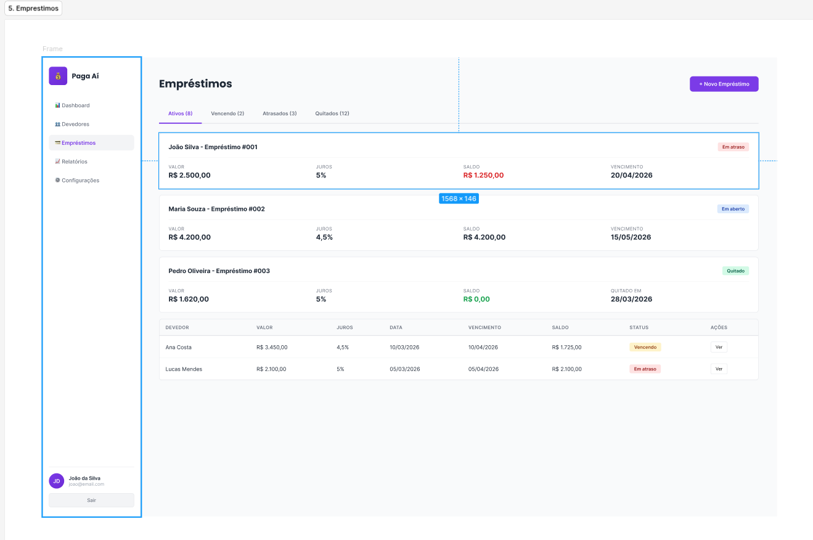
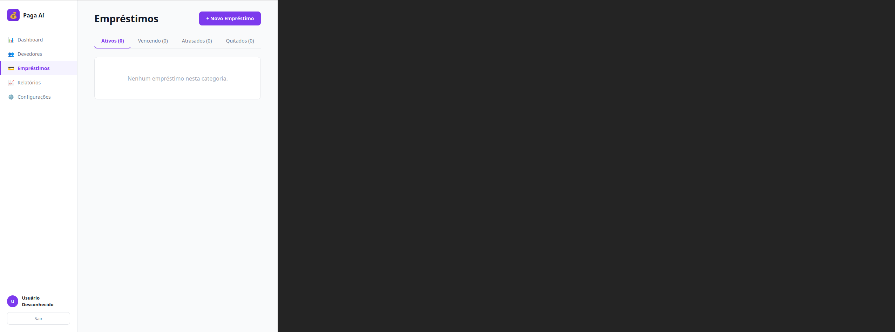
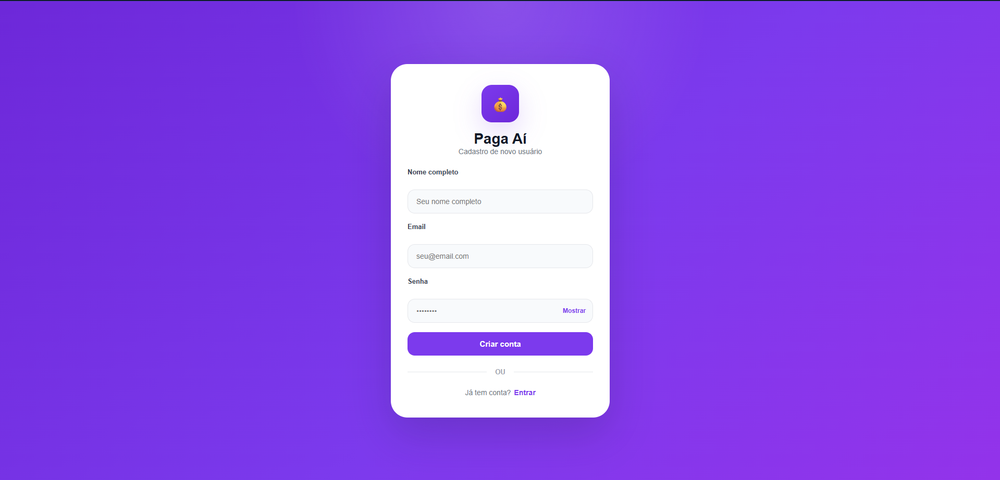
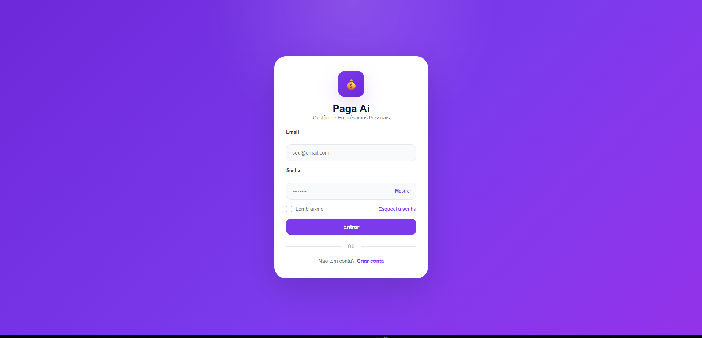
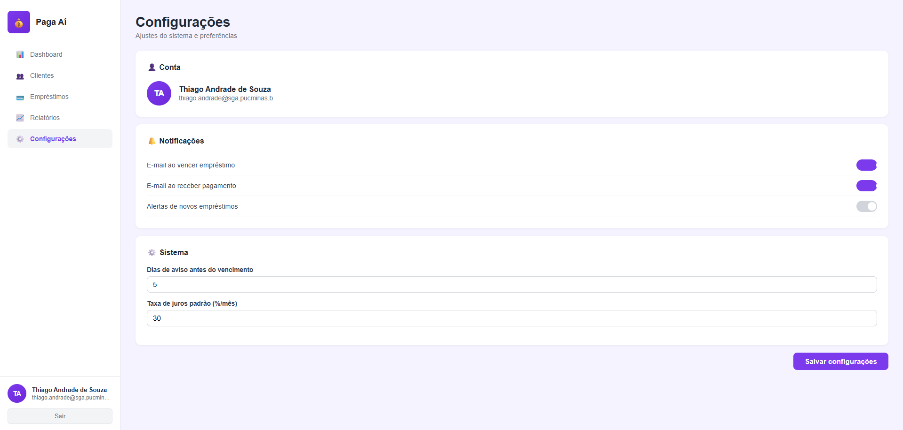
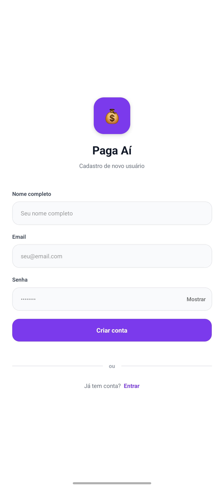
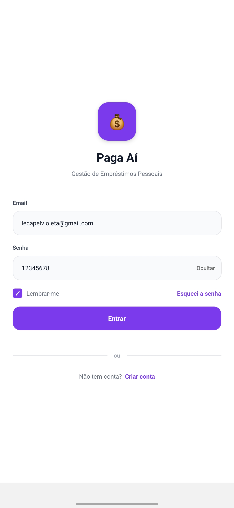
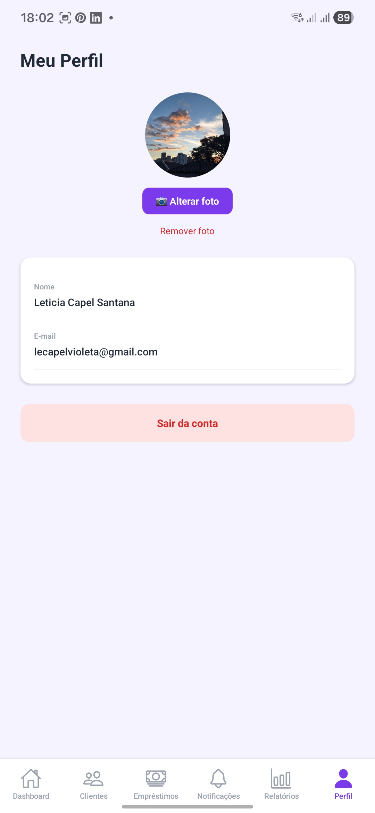

# Testes de Sistema no Backend

## O que são Testes de Sistema?

Testes de sistema são testes automatizados que verificam o comportamento completo de um sistema, validando que ele funciona conforme esperado em um ambiente real ou próximo do real. Eles englobam a verificação de todas as funcionalidades do sistema, desde a interface do usuário até a integração com bancos de dados, APIs externas e outros serviços.

## Por que são Importantes?

Testes de sistema ajudam a:

- Garantir que o sistema como um todo atende aos requisitos especificados.
- Identificar problemas que surgem em interações complexas entre componentes.
- Validar a funcionalidade completa em um ambiente que simula o uso real.
- Garantir que as mudanças no código não causem regressões em áreas não diretamente relacionadas.

## Configuração do Ambiente

Para começar a escrever testes de sistema em um projeto backend utilizando C#, siga os passos abaixo:

1. **Instale o .NET SDK**: Certifique-se de ter o [.NET SDK](https://dotnet.microsoft.com/download) instalado.

2. **Crie um projeto de testes de sistema**: No terminal, navegue até o diretório do seu projeto e execute o seguinte comando para criar um projeto de testes:

    ```bash
    dotnet new xunit -o tests
    ```

3. **Adicione uma referência ao seu projeto principal**: No diretório do projeto de testes, adicione uma referência ao seu projeto principal:

    ```bash
    dotnet add reference ../src/MyProject.csproj
    ```

4. **Configure o ambiente de teste**: Isso pode incluir a configuração de servidores, bancos de dados, e outros serviços necessários para que o sistema funcione como um todo.

5. **Organize sua estrutura de diretórios**: Uma estrutura comum de projeto é a seguinte:

    ```
    MyProject/
    ├── src/
    │   └── MyProject.cs
    └── tests/
        └── MyProject.SystemTests.cs
    ```

## Exemplo de Teste de Sistema

Vamos supor que temos um serviço web que gerencia usuários e oferece uma API REST para adicionar e consultar usuários. Vamos criar um teste de sistema para garantir que a API funciona corretamente.

### Código de Exemplo

Aqui está uma implementação simplificada do serviço:

```csharp
// src/MyProject.cs

using Microsoft.AspNetCore.Mvc;
using System.Collections.Generic;

namespace MyProject
{
    [ApiController]
    [Route("api/[controller]")]
    public class EmprestimosController : ControllerBase
    {
        private static List<Emprestimo> Emprestimos = new List<Emprestimo>();

        [HttpPost]
        public IActionResult CriarEmprestimo(Emprestimo emprestimo)
        {
            Emprestimos.Add(emprestimo);
            return Ok(new { mensagem = "Empréstimo realizado com sucesso!" });
        }

        [HttpGet]
        public IActionResult ObterEmprestimos()
        {
            return Ok(Emprestimos);
        }
    }

    public class Emprestimo
    {
        public int Id { get; set; }
        public string Item { get; set; }
        public string Usuario { get; set; }
        public string DataDevolucao { get; set; }
    }
}


    public class User
    {
        public string Name { get; set; }
        public string Email { get; set; }
    }
}
```
## Demonstração dos Requisitos Implementados (Web & Mobile)

Para validar o funcionamento completo do sistema (ponta a ponta), realizamos os testes integrando o back-end em C# com as interfaces de usuário.

### 1. Fluxo de Empréstimos - Plataforma Web

* **Descrição:** O usuário acessa o sistema pelo navegador, preenche os dados do empréstimo e envia a requisição para a API em C#.
* **Resultado:** A API processa os dados com sucesso e a tela atualiza mostrando o novo empréstimo na lista.
* **Evidência do Teste:**
  

---

### 2. Fluxo de Empréstimos - Aplicativo Mobile

* **Descrição:** O usuário abre o aplicativo no celular e visualiza a lista de empréstimos ativos cadastrados no banco de dados através da API.
* **Resultado:** Os dados são carregados rapidamente e exibidos em formato de cartões (cards) na tela do celular.
* **Evidência do Teste:**
  

---

### 3. Fluxo de Notificações - Plataforma Web

* **Descrição** Após o preenchimento do empréstimo, automaticamente irá criar um push da notificação de "Criação de Empréstimo"
* **Resultado** A API processa os dados, a tela atualiza listando a criação do emprestimo, ou quando for marcado como pago, ou quando estiver em atraso.
* **Evidência do Teste:**


---

### 4. Fluxo de Notificações - Aplicativo Mobile

* **Descrição:** O usuário abre o aplicativo no celular vai até a pagina de notificções onde lista todas as notificaçoes sober os empréstimos.
* **Resultado:** Os dados são carregados rapidamente e exibidos em formato de cartões (cards) na tela do celular.
* **Evidência do Teste:**


---

### 5. Fluxo de Autenticação e Gateway - Plataforma Web

* **Descrição:** O usuário acessa a interface Web, realiza cadastro e login, e as requisições são encaminhadas pelo gateway para a API de autenticação e usuários.
* **Resultado:** O fluxo de autenticação é concluído com sucesso e o usuário consegue acessar a aplicação pela plataforma Web.
* **Evidência do Teste:**
  
  
  

---

### 6. Fluxo de Autenticação e Gateway - Aplicativo Mobile

* **Descrição:** O usuário realiza cadastro e login no aplicativo Mobile, e o gateway repassa as requisições até a API de autenticação.
* **Resultado:** O aplicativo autentica o usuário com sucesso e permite o acesso ao sistema pelo Mobile.
* **Evidência do Teste:**
  
  
  
  
---

### Fluxo de Relatório - Plataforma Web
**Cenário 01 - Acessar tela de Relatórios**

**Dado** que o usuário esteja autenticado no sistema.<br>
**Quando** acessar o menu "Relatórios".<br>
**Então** o sistema deverá exibir a tela de Relatórios.


---

**Cenário 02 - Filtrar relatório por período**

**Dado** que o usuário esteja na tela de Relatórios.<br>
**Quando** informar a Data Inicial e a Data Final.<br>
**E** clicar no botão "Filtrar".<br>
**Então** o sistema deverá apresentar os dados financeiros correspondentes ao período informado.


---
**Cenário 03 - Visualizar indicadores financeiros**

**Dado** que exista movimentação para o período consultado<br>
**Quando** o filtro for executado<br>
**Então** o sistema deverá exibir os indicadores:<br>
- Total Emprestado
- Total Recebido
- Total Pendente
- Lucro Total


---

**Cenário 04 - Visualizar Empréstimos por Devedor**

**Dado** que existam empréstimos para o período consultado<br>
**Quando** o filtro for executado<br>
**Então** o sistema deverá exibir a relação de empréstimos agrupados por devedor.


---
**Cenário 05 - Visualizar Pagamentos Recentes**

**Dado** que existam pagamentos para o período consultado<br>
**Quando** o filtro for executado<br>
**Então** o sistema deverá exibir a relação de pagamentos recentes.


---

**Cenário 06 - Exportar relatório em PDF**

**Dado** que o usuário esteja na tela de Relatórios<br>
**Quando** clicar no botão "Exportar PDF"<br>
**Então** o sistema deverá gerar e realizar o download do arquivo PDF contendo os dados do relatório.


---

### Fluxo de Relatório - Aplicativo Mobile

**Cenário 01 - Acessar tela de Relatórios**

**Dado** que o usuário esteja autenticado no aplicativo<br>
**Quando** acessar a aba "Relatórios"<br>
**Então** o sistema deverá exibir a tela de Relatórios.


---

**Cenário 02 - Filtrar relatório por período**

**Dado** que o usuário esteja na tela de Relatórios<br>
**Quando** selecionar a Data Inicial e a Data Final<br>
**E** clicar em "Filtrar"<br>
**Então** o sistema deverá apresentar os dados financeiros correspondentes ao período informado.


---

**Cenário 03 - Visualizar indicadores financeiros**

**Dado** que existam registros para o período informado<br>
**Quando** o filtro for executado<br>
**Então** o sistema deverá exibir os indicadores financeiros do relatório.


---

**Cenário 04 - Exportar e compartilhar PDF**

**Dado** que o usuário esteja na tela de Relatórios<br>
**Quando** clicar no botão "Exportar PDF"<br>
**Então** o sistema deverá gerar o arquivo PDF<br>
**E** disponibilizar as opções de compartilhamento do dispositivo.


